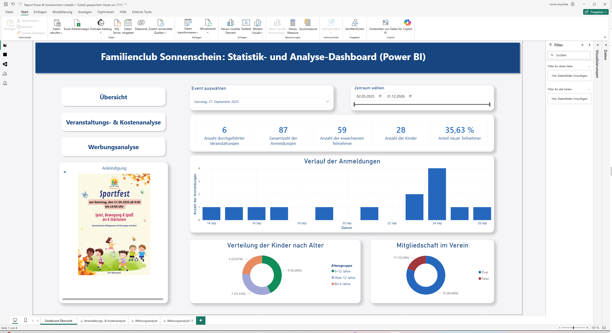
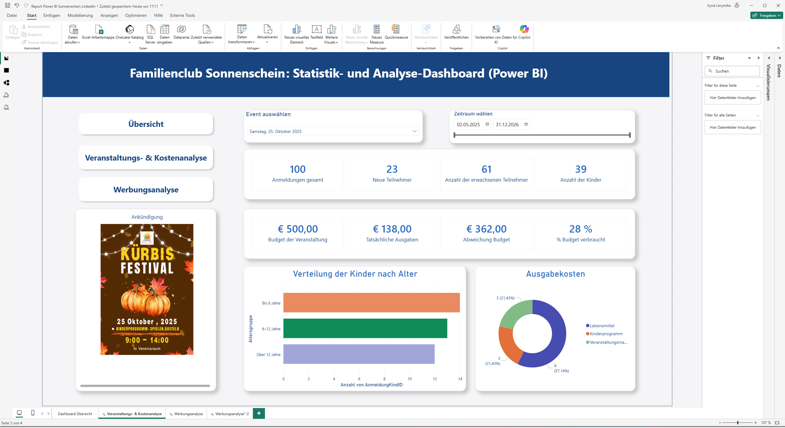
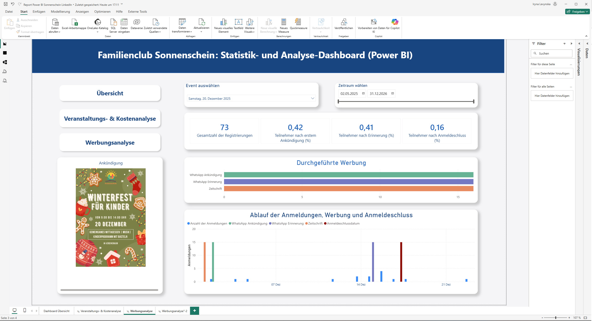

# Project_02 – Vereins-Event Management Dashboard

Dies ist ein interaktives Power BI Dashboard zur Analyse von Vereinsveranstaltungen.

## 📌 Funktionen / Insights
- Teilnehmerzahlen: Kinder / Erwachsene, neue vs. wiederkehrende Gäste
- Zentrale KPIs und Budgetübersicht
- Effektivität von Kommunikationskanälen

## 🛠 Technologien & Skills
- Power BI (Dashboard & Visualisierung)
- SQL Server (Datenmodellierung)
- DAX (Maße & KPIs)

## 🎬 Demo / Video
Hier ist das Video des Dashboards: [Video-Link](video.mp4)

## 📷 Screenshots

